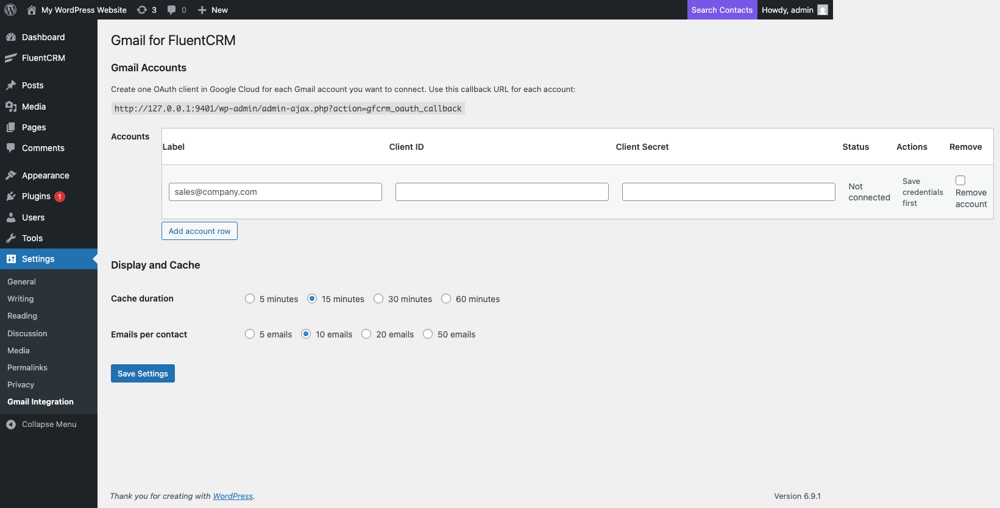
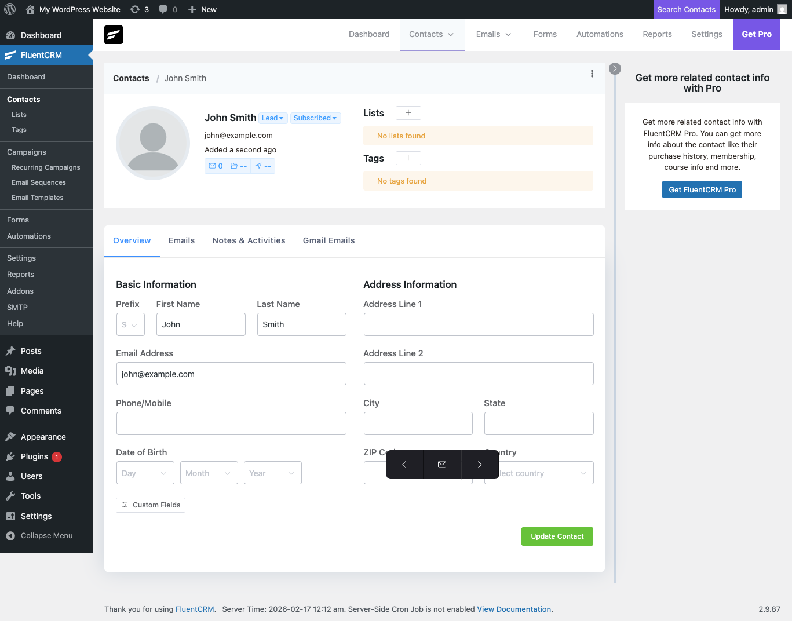
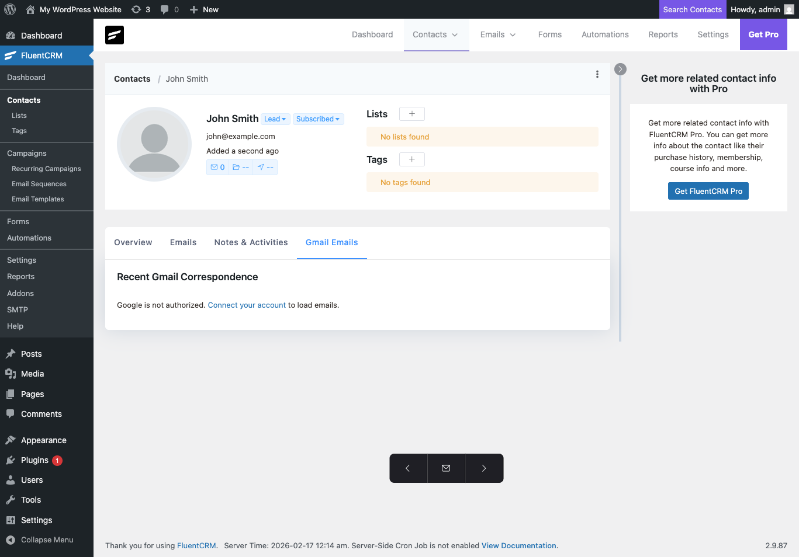

# Gmail for FluentCRM

Display Gmail email history directly inside FluentCRM contact profiles. See every conversation with a contact without leaving WordPress.

## Screenshots

### Settings Page
Configure Gmail accounts with OAuth credentials, cache duration, and email limits.

### Contact Profile – Gmail Emails Tab
A dedicated "Gmail Emails" tab appears on every FluentCRM contact profile, showing recent correspondence.

### Gmail Emails Tab (Active)
When connected, emails are fetched from Gmail and displayed inline. Before connecting, a prompt guides you to set up OAuth.

## Features

- **Gmail email history on contact profiles** – See every email exchanged with a contact directly in FluentCRM
- **Multi-account support** – Connect multiple Gmail accounts with independent OAuth credentials
- **Configurable cache** – Choose cache duration (5/15/30/60 minutes) to balance freshness vs. API usage
- **Adjustable email limits** – Display 5, 10, 20, or 50 emails per contact
- **Secure OAuth 2.0** – Uses Google's OAuth flow; tokens stored securely in WordPress options
- **Zero conflict** – Separate tab, doesn't modify FluentCRM's native UI

## Requirements

- WordPress 6.0+
- PHP 7.4+
- [FluentCRM](https://wordpress.org/plugins/fluent-crm/) (free version works)
- A Google Cloud project with Gmail API enabled

## Installation

1. Download or clone this repository into `wp-content/plugins/gmail-for-fluentcrm/`
2. Activate the plugin in WordPress
3. Go to **Settings → Gmail Integration**
4. Follow the [setup guide](SETUP.md) to create Google Cloud OAuth credentials
5. Enter your Client ID and Client Secret, then authorise

## Setup Guide

See [SETUP.md](SETUP.md) for a step-by-step walkthrough of creating a Google Cloud project, enabling the Gmail API, and configuring OAuth credentials.

## How It Works

1. The plugin registers a custom profile section tab ("Gmail Emails") via FluentCRM's `addProfileSection` API
2. When viewing a contact, it queries the Gmail API for messages matching the contact's email address
3. Results are cached in WordPress transients to minimise API calls
4. Multiple Gmail accounts can be connected – results are merged and deduplicated by message ID

## License

GPL-2.0-or-later. See [LICENSE](LICENSE) for details.

## Credits

Built by [Gladding Digital](https://gladdingdigital.com).
